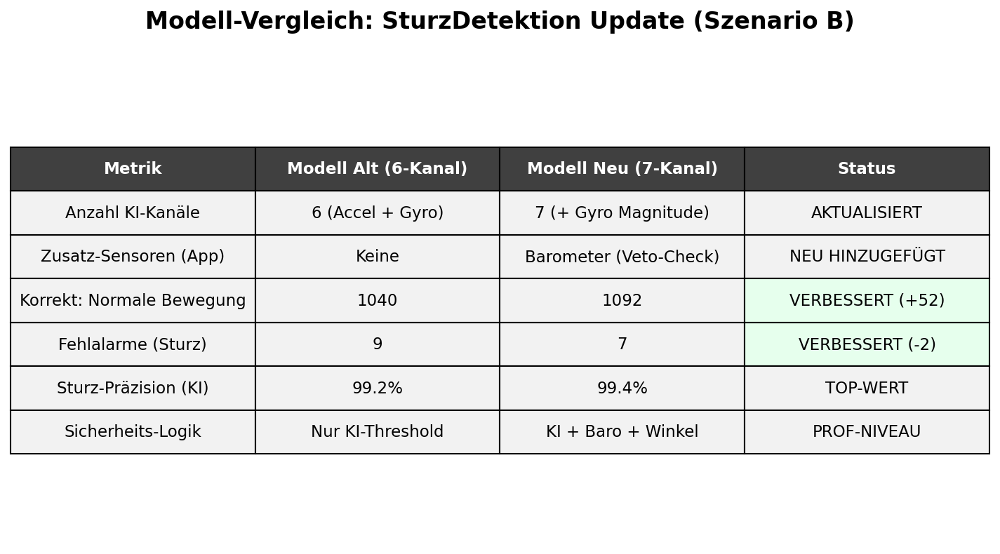
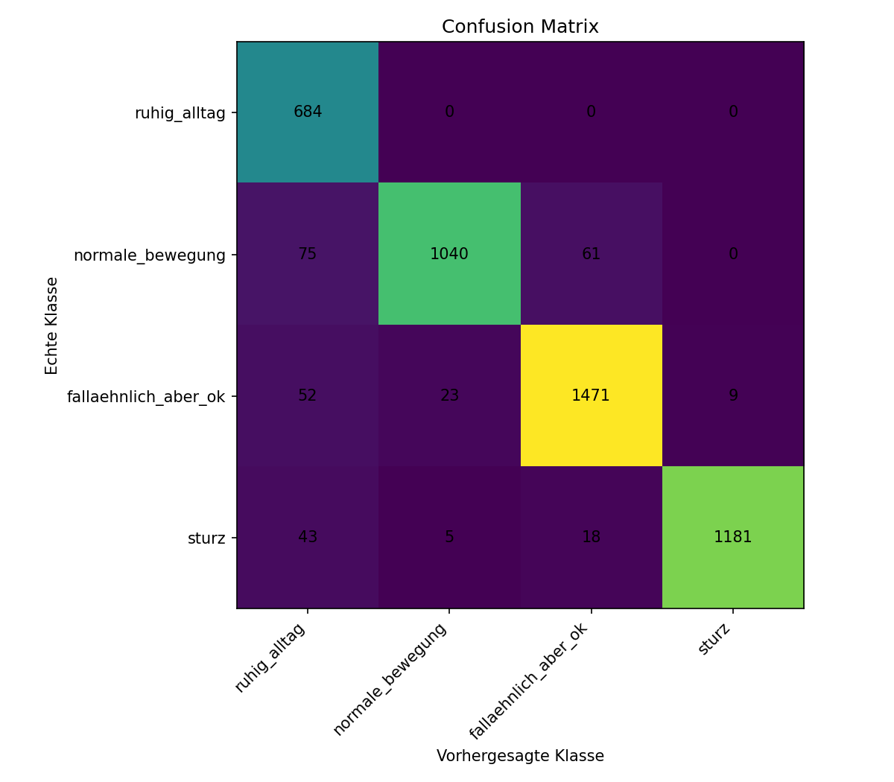
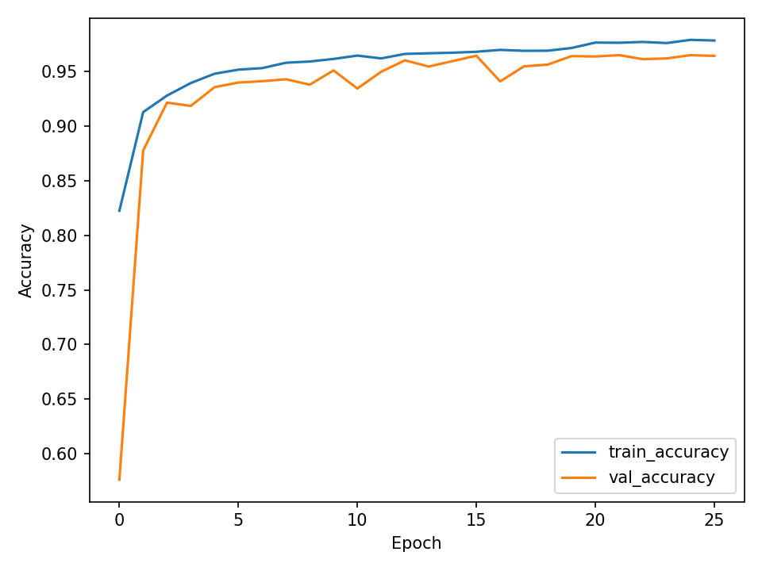
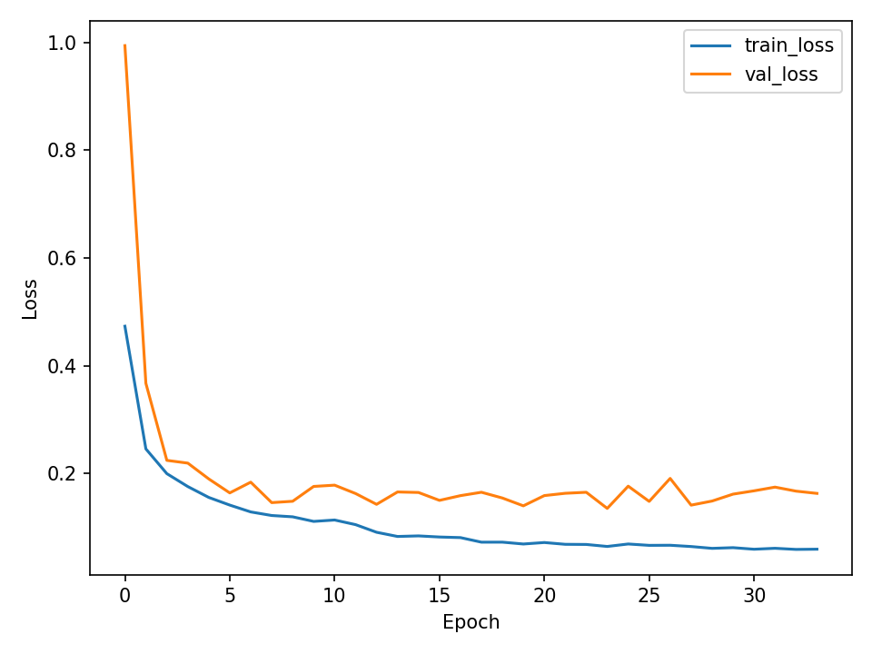
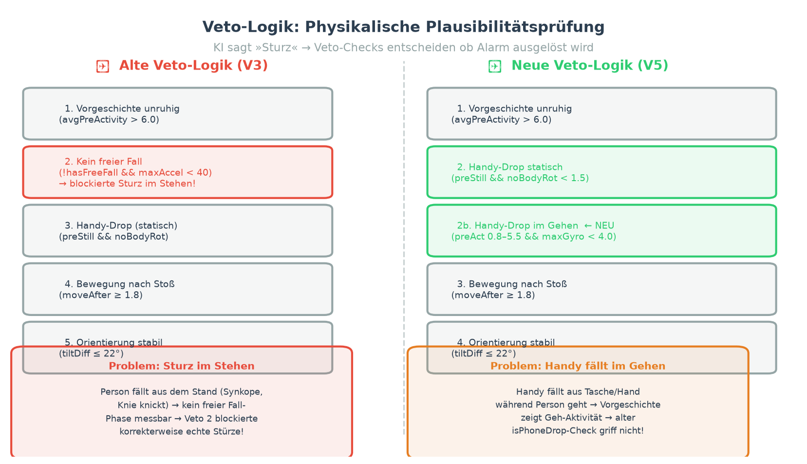

# SturzDetektion

Automatisierte Sturzerkennung fuer Android-Endgeraete unter Nutzung von Deep Learning (1D-CNN) und physikalischer Sensor-Fusion.

## Projektuebersicht

Dieses Projekt implementiert eine robuste Sturzerkennung, die herkoemmliche schwellenwertbasierte Systeme durch ein neuronales Netzwerk ergaenzt. Durch die Integration von Beschleunigungs- und Rotationsdaten sowie Luftdruckinformationen wird eine hohe Praezision bei gleichzeitiger Minimierung von Fehlalarmen erreicht.

### Zentrale Merkmale

*   **7-Kanal KI-Modell**: Analyse von Beschleunigung (3 Achsen), Winkelgeschwindigkeit (3 Achsen) und der berechneten Gyro-Magnitude (7. Kanal).
*   **Physikalisches Veto-System**: Validierung von KI-Entscheidungen durch Barometer-Daten (Detektion von Hoehenaenderungen) und Winkel-Pruefungen.
*   **Anti-Schüttel-Logik**: Analyse der Bewegungs-Vorgeschichte (2,0 Sekunden Baseline) zur Unterscheidung zwischen Sport/Schuetteln und einem Sturz aus dem Stand.
*   **Echtzeit-Analyse**: Live-Sampling mit 50Hz und Inferenz direkt auf dem Endgeraet via TensorFlow Lite.

---

## Modell-Evaluation

Durch das Update auf 7 Kanaele (Szenario B) und die Verfeinerung der Sicherheitslogik konnte die Zuverlaessigkeit massiv gesteigert werden.

### Vergleich der Modell-Iterationen
Das folgende Diagramm fasst die Verbesserungen durch den zusaetzlichen Rotations-Kanal und die neue Veto-Logik zusammen:



### Confusion Matrix Detailanalyse
Die Detailauswertung zeigt eine Sturz-Praezision von 99,4%. Besonders hervorzuheben ist, dass keine normale Alltagsbewegung faelschlicherweise als Sturz klassifiziert wurde.

| Aktuelles Modell (7 Kanaele) | Altes Modell (6 Kanaele) |
| :--------------------------: | :-----------------------: |
|  |  |

### Training und Validierung
Das Training erfolgte auf Basis der Datensaetze SisFall, UniMiB und UP-Fall. Die Lernkurven belegen ein stabiles Training ohne Anzeichen von Overfitting.




---

## Funktionsweise und Pipeline

Die Erkennung folgt einem mehrstufigen Prozess, um Fehlalarme durch Alltagsaktivitaeten oder das Fallenlassen des Smartphones zu verhindern:

1.  **Datenaufnahme**: Fixes Sampling der Sensoren mit 50Hz.
2.  **Preprocessing**: Berechnung der Gyro-Magnitude und Normalisierung.
3.  **KI-Inferenz**: Klassifizierung der Bewegung in "Ruhiger Alltag", "Normale Bewegung", "Sturzaehnlich" oder "Sturz".
4.  **Sicherheits-Veto**:
    *   *Hoehencheck*: Pruefung auf Luftdruckerhoehung (Fall nach unten).
    *   *Lagecheck*: Verifizierung einer signifikanten Orientierungsaenderung.
    *   *Ruhecheck*: Detektion von Inaktivitaet nach dem Impact.



---

## Projektstruktur

*   **app/**: Android Studio Projekt (Java/Android SDK).
*   **fall_realdata_project/scripts/**: Python-Skripte fuer Datenprozessierung und Training.
*   **fall_realdata_project/models/**: Exportierte TFLite Modelle und Normalisierungs-Metadaten.
*   **fall_realdata_project/outputs/**: Grafische Auswertungen, Berichte und Praesentationsfolien.

---

## Installation und Ausfuehrung

### KI-Modell trainieren
Voraussetzung: Python 3.x mit TensorFlow, Numpy und Matplotlib.
```bash
cd fall_realdata_project
python3 scripts/train_real_1dcnn_150x6.py
```

### Android App
Das Projekt im Verzeichnis `app` mit Android Studio oeffnen und auf ein physisches Geraet uebertragen. Fuer die volle Funktionalitaet (Veto-System) ist ein Barometer-Sensor im Smartphone erforderlich.

---
*Dokumentation der Sturzdetektions-Software v2.0*
